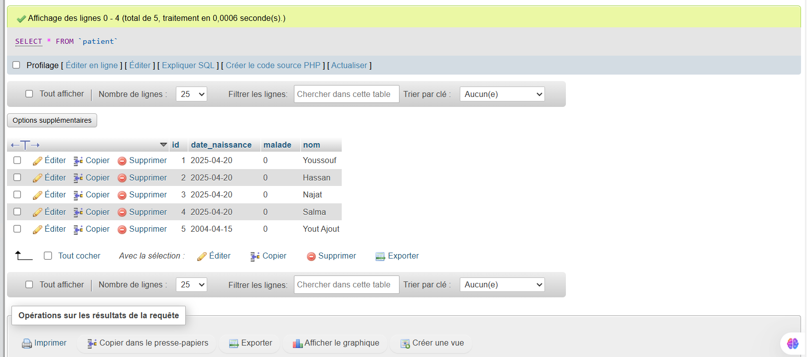

# Spring Boot JPA Hibernate Project - Hospital Management

## Description
Ce projet utilise Spring Boot avec JPA et Hibernate pour la gestion d'une application de **gestion des patients** dans un hôpital. Les entités principales incluent **Patient**, **RendezVous** (rendez-vous médicaux), et **Medecin** (médecin).

L'application utilise **H2** comme base de données en mémoire pour faciliter le développement et les tests, par la suite on migrera vers **MySQL** pour un environnement de production.

## Technologies Utilisées
- **Spring Boot 3.x**
- **JPA / Hibernate**
- **Lombok** (pour générer des getters/setters et autres méthodes)
- **H2 Database** (pour l'environnement de développement)
- **MySQL** (facultatif pour la production)

## Prérequis
Avant de lancer l'application, assurez-vous d'avoir installé les éléments suivants :
- **JDK 17+**
- **Maven** (ou **Gradle** selon le choix de ton projet)
- **IDE comme IntelliJ IDEA** pour le développement (optionnel mais recommandé)

## Installation

### Cloner le projet
```bash
git clone https://github.com/YoussoufHard/hospital-management-springjpa-hibernate.git
```

### Lancer l'application
1. Ouvrir le projet dans votre IDE préféré (IntelliJ, Eclipse, etc.)
2. Exécuter la classe principale (celle annotée avec `@SpringBootApplication`).
3. L'application sera lancée à l'adresse suivante : [http://localhost:8086](http://localhost:8086).

## Architecture du Projet
- **Entities :**
    - **Patient** : Contient les informations sur les patients (nom, date de naissance, malade, etc.).
    - **RendezVous** : Représente un rendez-vous entre un patient et un médecin.
    - **Medecin** : Contient les informations sur les médecins (nom, email, spécialité).
    - **Consultation** : Représente une consultation médicale, associée à un `RendezVous`. Elle contient la date de la consultation et un rapport médical.

- **Base de données :**
    - L'application utilise une **base H2 en mémoire** pour le développement et peut être facilement migrée vers **MySQL** pour un environnement de production.

## Fonctionnalités
Voici les principales fonctionnalités que l'application gère :
- **Ajout de patients** : Ajouter un patient avec ses informations.
- **Consultation des patients** : Lister tous les patients ou consulter un patient spécifique.
- **Gestion des rendez-vous** : Créer, consulter et modifier les rendez-vous entre un patient et un médecin.
- **Gestion des médecins** : Ajouter et gérer des médecins.

## Tests et Validation
Les entités et les relations ont été validées en utilisant la base H2 en mémoire.

- Après avoir exécuté l'application, les tables sont visibles dans la console H2 [http://localhost:8080/h2-console](http://localhost:8080/h2-console).
- La création et la mise à jour des entités sont automatiquement effectuées grâce à la configuration `ddl-auto=update`. 

#### voici la capture de la console h2
  

#### Capture d'écran de la console H2 après l'exécution de `CommandLineRunner`
Cette capture montre les données automatiquement insérées dans la base H2 grâce à l'exécution du bean `CommandLineRunner` au démarrage de l'application.

Patient


Medecin


RendezVous


Consultation


#### Capture d'écran de l'URL les operation CRUD `http://localhost:8086/patients`
Cette capture montre la liste des patients récupérée depuis l'endpoint **`/patients`** de l'application, accessible via l'URL **`http://localhost:8086/patients`**.


1. Ajout d'un patient (POST) avec postman
   

2. Consulter un patient par ID (GET) avec postman
   

3. Rechercher un patient par nom (GET)
   

4. Mettre à jour un patient (PUT)
   

5. Supprimer un patient (DELETE)
   

   
## Migration vers MySQL

#### 1. **Ajouter la dépendance MySQL dans `pom.xml` (Maven)**

Pour utiliser MySQL avec Spring Boot, tu dois ajouter la dépendance correspondante dans ton fichier `pom.xml`.

```xml
<dependency>
  <groupId>com.mysql</groupId>
  <artifactId>mysql-connector-j</artifactId>
  <scope>runtime</scope>
</dependency>

```

#### 2. **Configurer la connexion à MySQL dans `application.properties`**

Voici la configuration nécessaire pour connecter ton application à une base de données **MySQL** :

```properties
# Configuration pour MySQL
spring.datasource.url=jdbc:mysql://localhost:3306/hopital_gestion?createDatabaseIfNotExist=true&useSSL=false&serverTimezone=UTC
spring.datasource.username=root
spring.datasource.password=

# Initialisation de la source de données
spring.jpa.defer-datasource-initialization=true
spring.sql.init.mode=always

# Hibernate
spring.jpa.database-platform=org.hibernate.dialect.MySQL8Dialect
spring.jpa.hibernate.ddl-auto=update

# Afficher les requêtes SQL formatées
spring.jpa.show-sql=true
spring.jpa.properties.hibernate.format_sql=true
```

##### Explications des propriétés :

- **spring.datasource.url** : L'URL de connexion à MySQL. Ici, nous connectons l'application à la base de données `hopital_gestion` sur `localhost:3306`. L'option `createDatabaseIfNotExist=true` permet de créer la base de données automatiquement si elle n'existe pas. Les paramètres `useSSL=false` et `serverTimezone=UTC` sont ajoutés pour éviter des problèmes de connexion SSL et de timezone.
- **spring.datasource.username et spring.datasource.password** : Les informations de connexion à MySQL.
- **spring.jpa.defer-datasource-initialization** : Permet de retarder l'initialisation de la source de données jusqu'après l'exécution de toutes les commandes.
- **spring.sql.init.mode** : Définit que l'initialisation des données SQL se fait toujours au démarrage de l'application.
- **spring.jpa.database-platform** : Utilise `MySQL8Dialect` pour une compatibilité optimale avec MySQL 8.
- **spring.jpa.hibernate.ddl-auto** : Configure Hibernate pour qu'il gère automatiquement la création et la mise à jour des tables (`update` pour mettre à jour le schéma si nécessaire).
- **spring.jpa.show-sql** : Affiche les requêtes SQL générées par Hibernate dans la console pour faciliter le débogage.
- **spring.jpa.properties.hibernate.format_sql** : Formate les requêtes SQL pour les rendre plus lisibles dans la console.


#### 3. **Tester la migration**

- Lance l'application Spring Boot.
- Vérification dans la base de données MySQL que les tables sont créées automatiquement .
- Utilise les opérations CRUD via Postman ou l'interface Web pour vérifier que tout fonctionne correctement avec MySQL  (fait )

Capture de la base de donner MySQL avec les données

  

  

Capture d'ajout POSTMAN

  

Capture de la table patient apres test d'ajout


